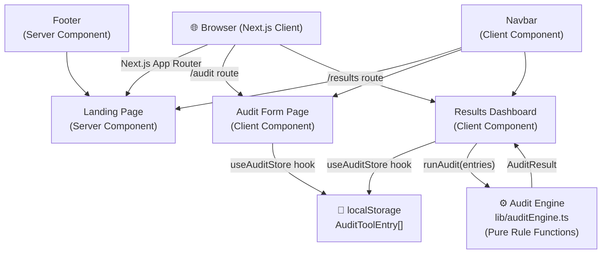

# ARCHITECTURE.md — AI Spend Audit

## Why Next.js 15 with App Router?

**Chosen over:** Vite+React SPA, Remix, Astro, plain CRA.

| Concern | Rationale |
|---|---|
| **SEO** | Landing page must rank for "AI tool audit", "ChatGPT cost optimization", etc. SSR/SSG enables crawlable HTML. |
| **Performance** | Server Components render the landing page shell with zero JS. Only interactive pages (audit form, results) ship client-side React. |
| **DX** | File-system routing, built-in image optimization, font optimization, and TypeScript support out of the box. |
| **Deployment** | Vercel-native: zero-config deploys, edge caching, preview URLs per PR. |
| **Scalability path** | App Router supports Route Handlers (API routes), so adding a backend later doesn't require architecture changes. |

## Why TypeScript?

- **Correctness**: The audit engine does math on currency values. TypeScript enforces `number` vs `string` at compile time.
- **Refactoring safety**: As pricing rules grow from 6 tools to 50+, type-checked interfaces prevent regressions.
- **IDE tooling**: Auto-complete for `AuditRecommendation` fields speeds up development 2–3×.
- **Team scale**: Type definitions serve as living documentation for any new engineer.

## System Architecture Diagram



## Data Flow

```
User Input → React Hook Form (Zod validation)
         → useAuditStore.addTool()
         → localStorage (persisted)
         → /results page load
         → useAuditStore reads tools[]
         → runAudit(tools[]) [pure function, no network]
         → AuditResult { recommendations, totals }
         → React render → UI
```

**Key properties of this flow:**
- **Zero network requests** for the core audit loop. Fully offline-capable.
- **Deterministic**: same input always produces same output. No ML, no randomness.
- **No PII leaves the browser**: spend data never hits a server at MVP stage.

## Day 3 Post-Audit Data Flow (Lead Capture & Sharing)

```
User clicks "Save Report" → React Hook Form Modal
          → /lib/supabase.ts: saveLeadAndAudit()
          → Supabase (leads & audits tables)
          → /api/email: Send Resend email
          → Generates public report URL (/results/[id])
```

**Key properties of this flow:**
- **AI Summary generation:** is invoked server-side on the fly or cached.
- **Privacy-first:** Public URLs only expose aggregated tool metrics and savings, never email or company name.

## Database Schema (Supabase PostgreSQL)

```sql
CREATE TABLE leads (
  id UUID DEFAULT gen_random_uuid() PRIMARY KEY,
  email TEXT NOT NULL,
  company_name TEXT,
  role TEXT,
  team_size TEXT,
  created_at TIMESTAMP WITH TIME ZONE DEFAULT NOW()
);

CREATE TABLE audits (
  id UUID DEFAULT gen_random_uuid() PRIMARY KEY,
  lead_id UUID REFERENCES leads(id) ON DELETE CASCADE,
  audit_data JSONB NOT NULL,
  total_savings NUMERIC NOT NULL,
  created_at TIMESTAMP WITH TIME ZONE DEFAULT NOW()
);
```

## Folder Structure

```
src/
├── app/                    # Next.js App Router
│   ├── layout.tsx          # Root layout (Navbar, Footer, fonts, SEO)
│   ├── globals.css         # Design tokens, animations, utilities
│   ├── page.tsx            # Landing page (Server Component)
│   ├── audit/
│   │   ├── layout.tsx      # Audit page SEO metadata
│   │   └── page.tsx        # Audit form (Client Component)
│   └── results/
│       ├── layout.tsx      # Results page SEO metadata
│       └── page.tsx        # Results dashboard (Client Component)
│
├── components/
│   ├── layout/
│   │   ├── Navbar.tsx      # Sticky glass nav
│   │   └── Footer.tsx      # Footer with links
│   └── ui/                 # Design system primitives
│       ├── Button.tsx      # Variants: primary, secondary, ghost, outline
│       ├── Card.tsx        # Glass-morphism card family
│       ├── Input.tsx       # Accessible labeled input
│       ├── Select.tsx      # Styled native select
│       ├── Badge.tsx       # Status badges
│       └── Skeleton.tsx    # Loading placeholders
│
├── hooks/
│   └── useAuditStore.ts    # localStorage persistence hook
│
├── lib/
│   ├── auditEngine.ts      # Rule-based optimization logic (pure functions)
│   └── utils.ts            # cn(), formatCurrency(), formatPercent()
│
└── types/
    └── audit.ts            # Shared TypeScript interfaces
```

## Audit Engine Design

The audit engine (`lib/auditEngine.ts`) is a **pure function module** — no side effects, no network, no state.

Each tool has its own rule function:
- `auditChatGPT(entry)` → checks plan + seat count → returns savings recommendation
- `auditClaude(entry)`
- `auditCursor(entry)`
- `auditGitHubCopilot(entry)`
- `auditGemini(entry)`
- `auditOpenAIAPI(entry)` → checks use case + spend thresholds

All rule functions return `Partial<AuditRecommendation>` — only overriding what they know. The `runAudit()` orchestrator fills in defaults and computes totals.

**Adding a new rule:** Add a case to the switch in `runAudit()` and write a new `auditXxx()` function. Zero changes needed anywhere else.

## Scalability Considerations

### Current (Day 1)
- Pure client-side. localStorage. Zero backend.
- Handles 1 user audit at a time.

### To 1,000 audits/day
- Add Next.js Route Handler: `POST /api/audit` 
- Persist results to **Postgres** (via Prisma or Drizzle)
- Add **Resend** for "email your results" feature
- Still no auth — use anonymous session IDs

### To 10,000 audits/day
- **Edge caching** via Vercel: cache common rule sets at edge (audit rules don't change per-user)
- **Rate limiting** via Upstash Redis on the API route
- **Analytics**: PostHog to track which tools/plans get the most audit requests
- **Queue**: BullMQ for non-realtime heavy audits (future: multi-tool deduplication)
- **Auth**: Clerk or NextAuth for user accounts + saved audit history
- **CDN**: Vercel's built-in CDN handles static assets; ISR for marketing pages

### Pricing Rule Updates
Currently pricing is hardcoded in `auditEngine.ts`. At scale:
- Move pricing to a JSON config file → audited and version-controlled
- Eventually: fetch pricing from a managed DB, cached with SWR + stale-while-revalidate

## Performance Strategy

| Goal | Implementation |
|---|---|
| Performance ≥ 85 | Server Components for landing page, lazy client hydration |
| Accessibility ≥ 90 | Semantic HTML, ARIA labels, focus management, skip links |
| Best Practices ≥ 90 | next/font (Inter), no render-blocking resources, proper meta |
| Bundle size | No heavy client-side libraries; native select, no icon font |

## Deployment

**Recommended: Vercel**

```bash
# One-command deploy after pushing to GitHub
npx vercel --prod
```

- Preview deploys on every PR (zero config)
- Edge Network CDN automatic
- Environment variables via Vercel dashboard
- Analytics built-in (Core Web Vitals)

## Day 2 Roadmap

1. **Email capture** → "Email me my results" with Resend
2. **API backend** → `POST /api/audit` saves results anonymously to Postgres
3. **Shareable results** → unique URL per audit (e.g., `/results/[auditId]`)
4. **Pricing data updates** → JSON config for easy rule updates
5. **More tools** → Midjourney, Perplexity, Notion AI, Copilot Studio
6. **Auth** → Clerk for saved audits + history dashboard
7. **Analytics** → PostHog for funnel tracking (form start → result view → email)
